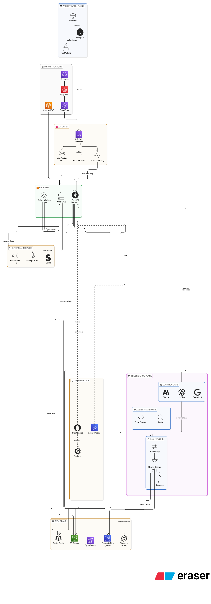

# KnowledgeForge — System Architecture

**Version:** 1.0.0
**Last Updated:** 2026-04-09
**Status:** In Development (Phase 1–2 complete)

---

## Table of Contents

1. [System Overview](#1-system-overview)
2. [High-Level Architecture](#2-high-level-architecture)
3. [Frontend Architecture](#3-frontend-architecture)
4. [Backend Architecture](#4-backend-architecture)
5. [RAG Pipeline](#5-rag-pipeline)
6. [Data Architecture](#6-data-architecture)
7. [Authentication & Authorization](#7-authentication--authorization)
8. [Real-Time Communication](#8-real-time-communication)
9. [AI & LLM Layer](#9-ai--llm-layer)
10. [Search Architecture](#10-search-architecture)
11. [Video Processing Pipeline](#11-video-processing-pipeline)
12. [Infrastructure & Deployment](#12-infrastructure--deployment)
13. [Observability Stack](#13-observability-stack)
14. [Security Architecture](#14-security-architecture)
15. [Multi-Tenancy](#15-multi-tenancy)
16. [Key Architecture Decisions](#16-key-architecture-decisions)
17. [Data Flow Diagrams](#17-data-flow-diagrams)

---

## 1. System Overview

KnowledgeForge is an enterprise-grade AI Knowledge Copilot that ingests, indexes, and reasons over organizational knowledge. The system is composed of three primary planes:

- **Data Plane** — ingestion pipelines, parsers, chunkers, embedding engines, vector store, and relational database
- **Intelligence Plane** — LLM providers, RAG chains, agent framework, search reranker
- **Presentation Plane** — Next.js frontend, WebSocket/SSE real-time layer, REST API

The architecture is designed for horizontal scalability, multi-tenancy, and zero-downtime AWS deployments via GitOps.

```
┌─────────────────────────────────────────────────────────────────────┐
│                        Presentation Plane                           │
│   Browser / Mobile  ←→  Next.js 14  ←→  NextAuth.js (sessions)     │
└─────────────────────────────┬───────────────────────────────────────┘
                              │ HTTPS / WSS
┌─────────────────────────────▼───────────────────────────────────────┐
│                         API Gateway / ALB                           │
│           REST (/api/v1/*)  │  WebSocket (/ws/*)  │  SSE           │
└──────────┬──────────────────┴──────────────────────┘────────────────┘
           │                                          │
┌──────────▼──────────┐                  ┌────────────▼──────────────┐
│   FastAPI Backend   │                  │  WebSocket Server (async) │
│   (Uvicorn async)   │                  │  chat / voice / meetings  │
└──────────┬──────────┘                  └────────────┬──────────────┘
           │                                          │
┌──────────▼──────────────────────────────────────────▼──────────────┐
│                        Intelligence Plane                           │
│  Claude / GPT-4 / Gemini  │  RAG Chain  │  Agent Framework        │
│  pgvector / Pinecone       │  Reranker   │  Web Search (Tavily)    │
└──────────┬──────────────────────────────────────────────────────────┘
           │
┌──────────▼──────────────────────────────────────────────────────────┐
│                          Data Plane                                 │
│  PostgreSQL (RDS)  │  Redis (ElastiCache)  │  S3  │  OpenSearch    │
│  pgvector          │  Session / Cache       │  Files│  Logs / Search │
└─────────────────────────────────────────────────────────────────────┘
```

---

## 2. High-Level Architecture



> *The diagram above shows the full system across seven planes: Presentation, Infrastructure, API Layer, Backend, External Services, Observability, Intelligence, and Data. Arrows indicate request and data flow direction.*

### Plane Summary

| Plane | Components |
|---|---|
| **Presentation** | Browser → AWS Amplify (Next.js 14 SSR) → NextAuth.js (authenticate) |
| **Infrastructure** | Route 53 → ACM (SSL) → CloudFront CDN + ALB → ECS Fargate |
| **API Layer** | ALB → REST `/api/v1/*`, WebSocket `/ws/*`, SSE token streaming |
| **Backend** | FastAPI on ECS Fargate, Celery Workers, WebSocket handlers |
| **External Services** | ElevenLabs TTS, Deepgram STT, Stripe Billing, Tavily Web Search |
| **Observability** | AWS CloudWatch (logs, metrics, alarms), X-Ray Tracing |
| **Intelligence** | LLM Providers (Claude, GPT-4, Gemini), Agent Framework (Tavily), RAG Pipeline (Embedding → Hybrid Search) |
| **Data** | Amazon RDS (PostgreSQL 16), ElastiCache Redis 7, S3, pgvector, Pinecone (scale) |

### Component Inventory

| Component | Technology | Hosting |
|---|---|---|
| Frontend | Next.js 14 (App Router, SSR) | AWS Amplify (Lambda@Edge per branch) |
| Backend API | FastAPI + Uvicorn | Amazon ECS Fargate |
| Container Registry | Docker images | Amazon ECR |
| WebSocket Server | FastAPI WebSocket | Same ECS task as backend API |
| Task Queue | Celery + Redis | ECS Fargate (separate service) |
| Primary DB | PostgreSQL 16 | Amazon RDS (private subnet) |
| Cache | Redis 7 | Amazon ElastiCache (private subnet) |
| Object Storage | Files, videos, backups | Amazon S3 + CloudFront |
| Vector Store | pgvector (primary) + Pinecone | RDS extension + Pinecone cloud |
| Cache | Redis 7 (ElastiCache) | Sessions, analytics TTL, rate limiting |
| Search | Elasticsearch / OpenSearch | Full-text search, hybrid retrieval |
| Object Storage | AWS S3 | Documents, recordings, videos |
| CDN | CloudFront | Static assets, video streaming (HLS) |
| LLM | Anthropic Claude | Chat, RAG, agents |
| Video AI | Google Gemini 2.0 Flash | Full video understanding |
| STT | Deepgram (streaming) / Whisper | Voice transcription |
| TTS | ElevenLabs / Amazon Polly | Voice synthesis |
| Web Search | Tavily / DuckDuckGo | Research agent live search |
| Orchestration | Amazon EKS (Kubernetes) | Container scheduling |
| GitOps | ArgoCD | Continuous deployment |
| IaC | Terraform + Terragrunt | Infrastructure provisioning |
| Monitoring | Prometheus + Grafana | Metrics and alerting |
| Tracing | OpenTelemetry + AWS X-Ray | Distributed tracing |
| Logging | ELK Stack (OpenSearch) | Structured log aggregation |

---

## 3. Frontend Architecture

### Technology Choices

The frontend uses **Next.js 14 App Router** with TypeScript strict mode. Route groups (`(auth)`, `(dashboard)`, `(marketing)`) allow separate layouts without URL nesting.

### Route Structure

```
src/app/
├── (auth)/                 # Unauthenticated — auth layout (no sidebar)
│   ├── login/
│   ├── register/
│   ├── forgot-password/
│   └── reset-password/
│
├── (dashboard)/            # Authenticated — sidebar + topbar layout
│   ├── home/               # KPI dashboard
│   ├── chat/               # AI chat + conversation list
│   ├── voice/              # Voice assistant
│   ├── meetings/           # Meeting rooms + recordings
│   ├── knowledge/          # Documents, collections, upload, crawlers
│   ├── knowledge-base/     # KB home
│   ├── video/              # Video library + AI player
│   ├── search/             # Enterprise search
│   ├── workflows/          # Workflow builder
│   ├── agents/             # Agent marketplace + builder
│   ├── analytics/          # Usage metrics + insights
│   ├── notifications/      # Notification center
│   ├── teams/              # Team management
│   ├── profile/            # User settings
│   ├── api-keys/           # API key management
│   └── admin/              # Admin panel (11 sub-pages)
│
├── (marketing)/            # Public — no auth, no sidebar
│   ├── about/
│   ├── blog/
│   ├── pricing/
│   └── ...
│
└── api/                    # Next.js API routes
    └── auth/[...nextauth]/ # NextAuth handler
```

### State Management

```
┌─────────────────────────────────────────────┐
│               State Layers                  │
│                                             │
│  Server State    →  TanStack React Query 5  │
│  (API data)         - Caching & refetching  │
│                     - Optimistic updates    │
│                     - Pagination            │
│                                             │
│  Client State    →  Zustand stores          │
│  (UI / user)        - chat-store.ts         │
│                     - ui-store.ts           │
│                     - user-store.ts         │
│                     - voice-store.ts        │
│                                             │
│  Auth State      →  NextAuth.js session     │
│  (tokens)           - JWT + refresh logic   │
└─────────────────────────────────────────────┘
```

### Authentication in the Frontend

NextAuth.js manages sessions with a custom credentials provider and two OAuth providers:

```
Login →  NextAuth credentials callback
      →  POST /auth/login → backend JWT (access + refresh)
      →  NextAuth stores tokens in encrypted session cookie

API call →  Middleware checks session
         →  If access token expires in < 2 min → auto-refresh
         →  POST /auth/refresh → new access token
         →  Session updated transparently
```

### Real-Time Client

- **SSE**: Chat streaming is consumed via the browser Fetch API with `ReadableStream`. The `useChat` hook processes token chunks as they arrive.
- **WebSocket**: Voice and meeting real-time data uses native browser WebSocket via the `useWebSocket` hook with automatic reconnect.

---

## 4. Backend Architecture

### Application Structure

```
backend/app/
├── main.py              # FastAPI app, middleware registration, router mounting
├── config.py            # Pydantic Settings — typed, validated env config
├── database.py          # SQLAlchemy async engine, session factory, indexes
├── dependencies.py      # Shared FastAPI dependencies (auth, DB session)
├── models/              # SQLAlchemy ORM models (declarative, async)
├── routers/             # One router per domain (auth, conversations, knowledge, …)
├── schemas/             # Pydantic v2 request/response schemas
├── services/            # Business logic — one service per domain
│   ├── ai_service.py    # RAG chain, LLM calls, SSE streaming
│   ├── document_service.py  # Chunking, embedding, storage
│   ├── search_service.py    # Hybrid search orchestration
│   └── vector_store.py      # pgvector / Pinecone abstraction
└── core/
    └── security.py      # JWT creation/validation, password hashing
```

### Request Lifecycle

```
HTTP Request
    ↓
CORS middleware  →  Rate limit middleware  →  Request ID injection
    ↓
FastAPI dependency resolution
    ├── get_db() → async database session
    └── get_current_user() → validate JWT → fetch user (Redis cache → DB)
    ↓
Route handler
    ├── Validate input (Pydantic schema)
    ├── Call service layer
    └── Return response (or StreamingResponse for SSE)
    ↓
Response middleware (logging, error handling)
```

### Service Layer Pattern

Services contain all business logic and are pure Python classes injected into route handlers:

```python
# Route handler delegates to service
@router.post("/conversations/{id}/messages")
async def send_message(id: UUID, body: MessageCreate, 
                        db: AsyncSession = Depends(get_db),
                        user: User = Depends(get_current_user)):
    return StreamingResponse(
        ai_service.stream_chat(db, user, id, body),
        media_type="text/event-stream"
    )
```

---

## 5. RAG Pipeline

The Retrieval-Augmented Generation pipeline is the core intelligence engine.

### Ingestion Phase

```
Document Upload (PDF / DOCX / XLSX / Video / URL)
    ↓
Parser Selection (by MIME type)
    ├── PDF    → PyPDF2 + pytesseract (OCR for scanned pages)
    ├── DOCX   → python-docx
    ├── XLSX   → openpyxl
    ├── PPTX   → python-pptx
    ├── Video  → Gemini 2.0 Flash (multimodal) or Whisper (audio-only)
    ├── URL    → trafilatura + BeautifulSoup fallback
    └── Image  → pytesseract OCR
    ↓
Semantic Chunking
    ├── Recursive sentence-aware splitting
    ├── Configurable chunk size (default 512 tokens) and overlap (64 tokens)
    └── Metadata attached: source, title, author, page, timestamp
    ↓
Embedding Generation
    └── OpenAI text-embedding-3-large (1536 dimensions)
    ↓
Dual Storage
    ├── pgvector → chunk text + embedding vector + metadata
    └── PostgreSQL GIN index → full-text tsvector for BM25
```

### Retrieval Phase

```
User Query
    ↓
Query Embedding (same model as ingestion)
    ↓
Parallel Retrieval
    ├── Vector Search (pgvector cosine similarity, top-K=20)
    └── Full-text Search (PostgreSQL GIN + ILIKE, stop-words filtered)
    ↓
Result Merge + Deduplication
    ↓
Relevance Guard
    └── Discard chunks with < 30% query-word overlap
    ↓
Per-Document Chunk Cap
    └── Max 2 chunks per source document (prevents dominance)
    ↓
Context Assembly
    └── Format chunks as cited context blocks
```

### Generation Phase

```
System Prompt
    ├── Role: enterprise AI assistant
    ├── KB inventory (all available document titles injected)
    ├── Retrieved context chunks with source citations
    └── Conversation history (last N turns)
    ↓
Claude claude-sonnet-4-6 (streaming)
    ↓
SSE Token Stream → browser
    ↓
Response saved to messages table + citation records
```

---

## 6. Data Architecture

### Database Schema (Key Tables)

```
users
  id, email, hashed_password, full_name, role, org_id,
  is_active, mfa_enabled, created_at

organizations
  id, name, slug, plan, settings (JSON), created_at

conversations
  id, user_id, org_id, title, model, system_prompt,
  created_at, updated_at

messages
  id, conversation_id, role (user|assistant), content,
  model, tokens_used, created_at

message_citations
  id, message_id, document_id, chunk_id, relevance_score

document_chunks
  id, document_id, content, chunk_index,
  embedding (vector(1536)), metadata (JSON),
  created_at

documents
  id, org_id, user_id, title, file_type, file_size,
  s3_key, status, chunk_count, created_at

connectors
  id, org_id, connector_type, config (JSON, encrypted),
  status, last_sync_at, created_at

knowledge_collections
  id, org_id, name, description, created_by, created_at

workflows
  id, org_id, name, trigger (JSON), steps (JSON),
  is_active, created_at
```

### Caching Strategy

| Data | Cache | TTL |
|---|---|---|
| User session / profile | Redis | 5 minutes |
| Analytics dashboard | Redis | 120 seconds |
| Home stats | Redis | 60 seconds |
| Search autocomplete | Redis | 300 seconds |
| Rate limit counters | Redis | Sliding window |

### Vector Storage

```
Development / Small Scale:
  pgvector (PostgreSQL extension)
    - IVFFLAT index (lists=100)
    - Cosine similarity operator (<=>)
    - Co-located with relational data

Production / Large Scale:
  Pinecone (managed service)
    - Separate namespace per organization (tenant isolation)
    - Metadata filtering for access control
    - ~1ms query latency at scale
```

---

## 7. Authentication & Authorization

### Token Architecture

```
Login success:
  ├── Access Token (JWT, HS256, 60 min expiry)
  │     payload: { sub: user_id, org_id, role, exp }
  └── Refresh Token (opaque UUID, 30 days, stored in DB)

API request:
  Authorization: Bearer <access_token>
  ↓
get_current_user() dependency:
  1. Decode + verify JWT signature
  2. Check expiry
  3. Fetch user from Redis cache (5 min) or PostgreSQL
  4. Attach user to request context

Refresh flow:
  POST /auth/refresh { refresh_token }
  → Validate token in DB (check not revoked)
  → Issue new access + refresh token pair (rotation)
  → Invalidate old refresh token
```

### RBAC Model

```
Roles (hierarchy):
  super_admin  →  full platform access (cross-org)
  admin        →  full org access
  member       →  standard access (create, read own resources)
  viewer       →  read-only access
  guest        →  limited access (shared content only)

Enforcement:
  Route level  → Depends(require_role("admin"))
  Query level  → All queries filter by org_id + user permissions
  Document     → Per-document ACL checked before content delivery
```

### OAuth2 Flow (Connectors)

```
User initiates connector auth
    ↓
Backend generates state token (CSRF protection) → Redis (5 min TTL)
    ↓
Redirect to provider (Google / GitHub / Slack / Notion)
    ↓
Provider redirects to /knowledge/connectors/callback/{provider}
    ↓
Backend validates state, exchanges code for tokens
    ↓
Tokens encrypted (AES-256) and stored in connectors table
    ↓
Initial sync triggered immediately
    ↓
Periodic sync scheduled via Celery Beat
```

---

## 8. Real-Time Communication

### SSE (Server-Sent Events) — Chat Streaming

```
POST /conversations/{id}/messages
    ↓
FastAPI returns StreamingResponse(media_type="text/event-stream")
    ↓
ai_service.stream_chat() is an async generator:
    - Calls Anthropic client with stream=True
    - Yields: data: {"token": "...", "done": false}\n\n
    - On complete: data: {"done": true, "citations": [...]}\n\n
    ↓
Browser EventSource / ReadableStream reads chunks
    ↓
useChat hook appends tokens to message buffer
```

### WebSocket — Voice & Meetings

```
/ws/voice/{session_id}
    ↓
Audio chunks (binary PCM) → Deepgram streaming STT → transcript segments
    ↓
Transcript assembled → Claude processes query → ElevenLabs TTS
    ↓
Audio response (base64) sent back over same WebSocket

/ws/meetings/{meeting_id}
    ↓
WebRTC signaling (offer / answer / ICE candidates)
    ↓
Meeting events (join, leave, mute, transcription segments)
    ↓
Broadcast to all participants in meeting room
```

---

## 9. AI & LLM Layer

### Provider Abstraction

All LLM calls go through `ai_service.py` which provides a unified interface. Switching providers requires no changes in route handlers or services.

```
ai_service.stream_chat(model="claude-sonnet-4-6", ...)
    ↓
Provider router:
    "claude-*"   → Anthropic SDK (anthropic==0.26.0)
    "gpt-*"      → OpenAI SDK (openai==1.30.1)
    "gemini-*"   → google-generativeai
    mock         → Static response (CI / no-key environments)
```

### Supported Models

| Provider | Models | Use Case |
|---|---|---|
| Anthropic | `claude-sonnet-4-6` (default) | Chat, RAG, agents |
| OpenAI | `gpt-4o`, `gpt-4-turbo` | Multi-model fallback |
| Google | `gemini-2.0-flash` | Video understanding |
| OpenAI | `whisper-1` | Audio transcription fallback |

### Agent Framework

```
Agent Execution Request
    ↓
Agent config loaded (tools, knowledge scope, system prompt)
    ↓
Tool resolution:
    ├── knowledge_search → RAG pipeline
    ├── web_search       → Tavily API (DuckDuckGo fallback)
    ├── email_sender     → SMTP / SES
    ├── code_executor    → Sandboxed Python exec
    ├── api_caller       → httpx async client
    └── document_creator → Generate + store document
    ↓
ReAct loop: Think → Act → Observe (max N iterations)
    ↓
Final response with tool execution trace
```

---

## 10. Search Architecture

### Hybrid Search Pipeline

```
User Query
    ↓
┌─────────────────────────────┐
│   Parallel Search Paths     │
│                             │
│  Dense (Semantic)           │
│  Query → Embedding →        │
│  pgvector cosine sim →      │
│  Top-20 chunks              │
│                             │
│  Sparse (BM25 / Full-text)  │
│  Query → tokenize →         │
│  stop-word filter →         │
│  PostgreSQL GIN ILIKE →     │
│  Top-20 chunks              │
└──────────┬──────────────────┘
           ↓
Reciprocal Rank Fusion (RRF)
    ↓
Relevance Guard (< 30% match → discard)
    ↓
Per-document chunk cap (max 2 per source)
    ↓
Top-K results (default K=5 for RAG, K=10 for search UI)
    ↓
Response with highlighted snippets + source metadata
```

### Search Indexes

```sql
-- Vector similarity index (pgvector)
CREATE INDEX idx_chunks_embedding 
ON document_chunks USING ivfflat (embedding vector_cosine_ops)
WITH (lists = 100);

-- Full-text search index
CREATE INDEX idx_chunks_fts 
ON document_chunks USING gin(to_tsvector('english', content));

-- Conversation lookup
CREATE INDEX idx_messages_conversation 
ON messages(conversation_id, created_at DESC);
```

---

## 11. Video Processing Pipeline

```
Video Upload (multipart form, up to 100MB)
    ↓
S3 upload (streaming, not buffered in memory)
    ↓
Processing triggered (async via Celery task)
    ↓
GOOGLE_API_KEY set?
    │
    ├── YES → Gemini 2.0 Flash (multimodal)
    │           ├── Audio track analysis
    │           ├── Visual frame analysis
    │           ├── On-screen text (OCR)
    │           ├── Slide and diagram understanding
    │           └── Returns:
    │               ├── Timestamped transcript
    │               ├── Visual descriptions
    │               ├── Key topics list
    │               └── Executive summary
    │
    └── NO  → OpenAI Whisper
                └── Audio-only transcript
    ↓
Content chunked and embedded (same pipeline as documents)
    ↓
Chapter markers generated (AI-detected topic boundaries)
    ↓
Video record updated: status=ready, chapters, transcript
    ↓
CloudFront HLS streaming URL generated
```

---

## 12. Infrastructure & Deployment

### AWS Architecture

```
Internet
    ↓
Route 53 (DNS)  →  ACM (SSL/TLS certificates)
    ↓
┌───────────────────────────────────────────────┐
│            Frontend — AWS Amplify             │
│  Next.js 14 SSR (Lambda@Edge per branch)      │
│  Branch: dev  → dev.d2dg07mc33522q.amplify… │
│  Branch: main → app.knowledgeforge.ai         │
│  Env vars injected at build time              │
└──────────────────────┬────────────────────────┘
                       │ HTTPS (via /api/backend proxy rewrite)
┌──────────────────────▼────────────────────────┐
│       ALB — Application Load Balancer          │
│   HTTP:80 → HTTPS:443 redirect                │
│   Health check: GET /health                   │
└──────────────────────┬────────────────────────┘
                       │
┌──────────────────────▼────────────────────────┐
│       ECS Fargate — Backend Service            │
│   Cluster: knowledgeforge-prod                 │
│   Task: FastAPI + Uvicorn (port 8000)          │
│   Desired: 1–10 tasks (CPU + memory scaling)   │
│   Image: ECR → knowledgeforge-backend-prod     │
│   Secrets: AWS Secrets Manager (at task start) │
└──────┬───────────────────────────┬─────────────┘
       │                           │
┌──────▼──────────┐   ┌────────────▼──────────────┐
│  Amazon RDS     │   │  Amazon ElastiCache        │
│  PostgreSQL 16  │   │  Redis 7 (cache.t4g.micro) │
│  (private subnet│   │  TLS + cluster config EP   │
└─────────────────┘   └───────────────────────────┘
       │
┌──────▼──────────┐
│  Amazon S3      │
│  (file storage) │
│  CloudFront CDN │
│  (media stream) │
└─────────────────┘
```

**Region:** ap-south-1 (Mumbai)

### CI/CD Pipeline

```
Developer push to dev/main → GitHub
    ↓
GitHub Actions CI (.github/workflows/ci-backend.yml):
    ├── Python lint (ruff) + type check
    ├── Unit tests (pytest)
    └── Docker build validation
    ↓
GitHub Actions CD (.github/workflows/cd-backend.yml):
    ├── docker build ./backend
    ├── docker push → Amazon ECR (tagged with git SHA)
    ├── aws ecs update-service --force-new-deployment
    └── aws ecs wait services-stable (health check gate)
    ↓
GitHub Actions CD (.github/workflows/cd-frontend-amplify.yml):
    └── aws amplify start-job (triggers Amplify build)
    ↓
AWS Amplify builds Next.js → deploys SSR Lambda
    ├── Environment variables injected at build time
    └── CloudFront invalidation on successful deploy
```

### ECS Task Configuration

```
Task Definition: knowledgeforge-backend-prod
  CPU:    512 vCPU units (0.5 vCPU)
  Memory: 1024 MB
  Launch type: FARGATE
  Network mode: awsvpc (private subnets)

Container:
  Image: <account>.dkr.ecr.ap-south-1.amazonaws.com/knowledgeforge-backend-prod:<sha>
  Port: 8000
  Environment: injected from AWS Secrets Manager at task start
  Log driver: awslogs → /ecs/knowledgeforge-backend-prod (CloudWatch)

Auto Scaling:
  Min tasks: 1
  Max tasks: 10
  Scale out: CPU > 70% for 2 consecutive 5-min periods
  Scale out: Memory > 75% for 2 consecutive 5-min periods
  Scale in:  CPU < 40% for 15 minutes
```

### Database Migrations

Alembic migrations are run manually via ECS Exec or as a one-off ECS task before deploying a new backend revision:

```bash
# Run migrations via ECS Exec (requires ECS Exec enabled on task)
aws ecs execute-command \
  --cluster knowledgeforge-prod \
  --task <TASK_ARN> \
  --container knowledgeforge-backend \
  --command "alembic upgrade head" \
  --interactive

# Or trigger migration as a one-off Fargate task
aws ecs run-task \
  --cluster knowledgeforge-prod \
  --task-definition knowledgeforge-backend-prod \
  --launch-type FARGATE \
  --overrides '{"containerOverrides":[{"name":"knowledgeforge-backend","command":["alembic","upgrade","head"]}]}' \
  --network-configuration "awsvpcConfiguration={subnets=[PRIVATE_SUBNET_ID],securityGroups=[SG_ID],assignPublicIp=DISABLED}"
```

---

## 13. Observability Stack

### Metrics (Prometheus + Grafana)

| Metric | Description |
|---|---|
| `http_request_duration_seconds` | API latency histogram by endpoint |
| `llm_request_duration_seconds` | LLM call latency by model |
| `llm_tokens_total` | Token usage by model and org |
| `rag_chunks_retrieved` | Chunks retrieved per query |
| `document_ingestion_duration` | Ingestion pipeline latency |
| `celery_task_duration_seconds` | Async task duration by task name |
| `active_websocket_connections` | Current WebSocket connections |

### Distributed Tracing (OpenTelemetry → X-Ray)

Every request carries a `X-Request-ID` header. Traces span:
- Frontend API call → Backend route → Service → DB query → LLM call → SSE response

### Structured Logging (ELK / OpenSearch)

```json
{
  "timestamp": "2026-04-09T10:30:00Z",
  "level": "INFO",
  "request_id": "550e8400-e29b-41d4-a716-446655440000",
  "user_id": "usr_abc123",
  "org_id": "org_xyz789",
  "method": "POST",
  "path": "/conversations/123/messages",
  "duration_ms": 1243,
  "tokens_used": 847,
  "model": "claude-sonnet-4-6",
  "chunks_retrieved": 4
}
```

### Alerting

| Alert | Threshold | Channel |
|---|---|---|
| API error rate | > 1% over 5 min | PagerDuty |
| P95 latency | > 3s over 5 min | PagerDuty |
| LLM error rate | > 5% over 2 min | Slack + PagerDuty |
| DB connection pool | > 80% saturation | Slack |
| Celery queue depth | > 1000 tasks | Slack |
| Pod crash loop | 3 restarts in 5 min | PagerDuty |

---

## 14. Security Architecture

### Network Security

```
Internet → WAF (AWS WAF) → CloudFront → ALB → EKS (private subnets)

WAF rules:
  - OWASP Core Rule Set (CRS)
  - Rate limiting by IP (100 req/min)
  - SQL injection protection
  - XSS protection
  - Known bad IP reputation lists
```

### Encryption

| Layer | Encryption |
|---|---|
| Data in transit | TLS 1.3 (enforced at ALB + CloudFront) |
| Data at rest (RDS) | AES-256 (AWS managed keys) |
| Data at rest (S3) | AES-256 SSE-S3 |
| Data at rest (ElastiCache) | AES-256 in-transit + at-rest |
| OAuth tokens (connectors) | AES-256 application-level encryption before DB storage |
| Passwords | bcrypt (cost factor 12) |
| JWT signing | HS256 with 256-bit secret |

### Secrets Management

```
AWS Secrets Manager (production):
  - Database credentials (auto-rotation every 30 days)
  - API keys (Anthropic, OpenAI, Google)
  - JWT secret key
  - OAuth client secrets

Kubernetes External Secrets Operator:
  - Syncs secrets from AWS Secrets Manager → Kubernetes Secrets
  - Pods mount secrets as environment variables (never baked into images)
```

### Input Validation

- All API inputs validated by Pydantic v2 schemas before reaching service layer
- File uploads validated for MIME type, extension, and maximum size (50MB)
- SQL injection prevented by SQLAlchemy ORM parameterized queries (no raw SQL)
- XSS prevented by Pydantic sanitization + Content-Security-Policy headers
- SSRF prevented by allowlist-only URL fetching in web crawler

---

## 15. Multi-Tenancy

### Isolation Model

KnowledgeForge uses **logical multi-tenancy** with application-layer isolation enforced through consistent `org_id` filtering on all database queries.

```
Organization A                Organization B
    │                              │
    ├── users (filtered)           ├── users (filtered)
    ├── documents (filtered)       ├── documents (filtered)
    ├── conversations (filtered)   ├── conversations (filtered)
    └── Pinecone namespace: A      └── Pinecone namespace: B
```

### Tenant Enforcement

```python
# Every query automatically scoped to org
async def get_documents(db: AsyncSession, org_id: UUID):
    result = await db.execute(
        select(Document).where(Document.org_id == org_id)
    )
    return result.scalars().all()
```

The `get_current_user()` dependency attaches `user.org_id` to every request. Services always receive this `org_id` and never query without it.

### Per-Tenant Configuration

| Feature | Per-Tenant |
|---|---|
| AI model selection | ✅ configurable |
| Rate limits and quotas | ✅ per plan |
| Branding (logo, colors, domain) | ✅ white-label |
| Data retention policy | ✅ configurable |
| Pinecone vector namespace | ✅ isolated |
| Encryption key | ✅ per-tenant (Enterprise) |
| SSO configuration | ✅ per-tenant |

---

## 16. Key Architecture Decisions

### ADR-001: FastAPI over Django

**Decision**: FastAPI for the backend framework.

**Rationale**: FastAPI is async-native (asyncio + uvicorn), which is essential for concurrent SSE streaming to thousands of clients simultaneously. Django is synchronous by default and requires ASGI adapters that add complexity. FastAPI also generates OpenAPI 3.1 documentation automatically and has native Pydantic v2 validation.

**Trade-off**: FastAPI has a smaller ecosystem than Django; no built-in admin interface (solved by our custom Next.js admin panel).

---

### ADR-002: pgvector as Primary Vector Store

**Decision**: Use PostgreSQL pgvector extension as the primary vector store with Pinecone as a production-scale alternative.

**Rationale**: pgvector co-locates vector embeddings with relational metadata in a single database, eliminating synchronization complexity. IVFFLAT index provides acceptable performance up to ~1M vectors. For organizations with >1M chunks, Pinecone provides managed, low-latency vector search with native namespace isolation for multi-tenancy.

**Trade-off**: pgvector query latency (~5ms) is higher than Pinecone (~1ms) at scale, but acceptable for most enterprise deployments.

---

### ADR-003: Hybrid Search (Semantic + BM25)

**Decision**: Always run both semantic vector search and BM25 full-text search in parallel, then merge results with Reciprocal Rank Fusion.

**Rationale**: Semantic search excels at conceptual queries ("how does our refund policy work") but misses exact keyword matches (product codes, names, technical terms). BM25 excels at exact matching but misses synonyms and intent. Hybrid consistently outperforms either alone by ~15-20% recall in enterprise knowledge retrieval tasks.

---

### ADR-004: SSE over WebSocket for Chat Streaming

**Decision**: Use Server-Sent Events (SSE) for chat response streaming, WebSocket only for bidirectional real-time (voice, meetings).

**Rationale**: SSE is simpler (standard HTTP, no upgrade handshake, automatic reconnect, works through HTTP/2 multiplexing), and chat is inherently unidirectional (server pushes tokens to client). WebSocket adds bidirectional overhead that is only needed for voice (sends audio chunks) and meetings (signaling).

---

### ADR-005: Schema-per-Tenant vs. Database-per-Tenant

**Decision**: Logical isolation with `org_id` column on all tables, not separate schemas or databases.

**Rationale**: Database-per-tenant doesn't scale operationally (hundreds of databases to migrate, backup, monitor). Schema-per-tenant offers isolation but requires connection-pool-per-schema and complex Alembic migration orchestration. Column-level isolation with consistent enforcement via the service layer provides the same security properties with simpler operations. Pinecone namespaces handle vector isolation without schema complexity.

---

### ADR-006: EKS over ECS

**Decision**: Amazon EKS (Kubernetes) for container orchestration.

**Rationale**: EKS provides the full Kubernetes ecosystem: Helm for package management, ArgoCD for GitOps, Karpenter for intelligent node provisioning, and HPA with custom metrics. ECS is simpler but lacks the ecosystem depth needed for complex auto-scaling scenarios (e.g., scaling Celery workers based on queue depth via KEDA).

---

### ADR-007: GitOps with ArgoCD

**Decision**: ArgoCD as the continuous delivery engine, with Git as the single source of truth for deployment state.

**Rationale**: GitOps provides automatic drift detection (cluster state vs. desired state), a complete audit trail of every deployment via git history, and one-click rollback by reverting a commit. Manual `kubectl apply` commands leave no audit trail and are error-prone.

---

### ADR-008: Next.js App Router Route Groups

**Decision**: Use Next.js route groups (`(auth)`, `(dashboard)`, `(marketing)`) for layout isolation.

**Rationale**: Route groups allow completely different layouts (auth pages have no sidebar, marketing pages have a public nav) without affecting the URL structure. This avoids the anti-pattern of embedding layout state in URL segments (e.g., `/dashboard/chat` vs `/chat`).

---

## 17. Data Flow Diagrams

### Document Ingestion Flow

```
User
 │
 │  POST /knowledge/documents (multipart)
 ▼
FastAPI router (knowledge.py)
 │
 ├── Validate: file type, size, auth
 ├── Save to S3 (streaming, no memory buffer)
 ├── Create Document record (status=processing)
 │
 └── Trigger async processing:
      │
      ▼
   document_service.process_document()
      │
      ├── Download from S3
      ├── Parse (PDF/DOCX/video/URL)
      ├── Chunk (recursive, semantic boundaries)
      ├── Generate embeddings (OpenAI)
      ├── Store chunks in document_chunks (pgvector)
      ├── Update full-text GIN index
      └── Update Document.status = "ready"
      │
      ▼
   WebSocket push → frontend (indexing complete notification)
```

### Chat Message Flow

```
User types message → Submit
 │
 │  POST /conversations/{id}/messages
 ▼
FastAPI router (conversations.py)
 │
 ├── Validate auth + org access
 ├── Save user message to DB
 │
 └── Return StreamingResponse(ai_service.stream_chat())
      │
      ▼
   ai_service.stream_chat()
      │
      ├── Embed query (OpenAI)
      │
      ├── Parallel retrieval:
      │    ├── pgvector similarity search
      │    └── PostgreSQL GIN full-text search
      │
      ├── Merge + filter + cap chunks
      │
      ├── Build prompt:
      │    ├── System: role + KB inventory + retrieved context
      │    └── History: last N messages
      │
      ├── Call Anthropic (stream=True)
      │
      └── Yield SSE tokens → browser
           │
           ▼ (on complete)
      Save assistant message + citations to DB
```

### Connector Sync Flow

```
Celery Beat (scheduled) or Manual trigger
 │
 │  POST /knowledge/connectors/{id}/sync
 ▼
Celery task: sync_connector.delay(connector_id)
 │
 ├── Load connector config (decrypt tokens)
 ├── Authenticate with provider API
 ├── Fetch changed content since last_sync_at
 │    (incremental sync via provider change APIs)
 │
 ├── For each item:
 │    ├── Download content
 │    ├── Detect near-duplicates (MinHash)
 │    ├── Parse + chunk + embed
 │    └── Upsert in document_chunks
 │
 ├── Update connector.last_sync_at
 └── Record sync job result (status, item_count, errors)
```
